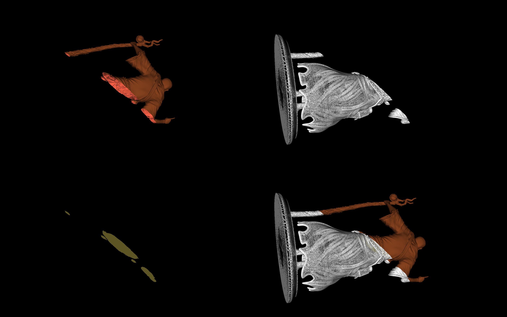

# MM - 804 Assignment 2

## Requirements
vtk==9.1.0
python==3.8.8

## Steps to follow to execute
Download the required packages in your local system with the given command.

pip install -r requirements.txt

Then run python file using command:

python assignmentSolution.py

# Output
Once the above steps are executed the output obtained is as follows:

